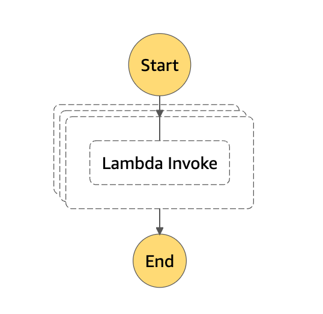

# sfn-dist-k6

An example (PoC) of [k6](https://k6.io) on Lambda with Step Functions Distributed Map.


## description

See [Makefile](Makefile).

```console
$ make help
Please use `make <target>' where <target> is one of
  clean             to clean up
  k6                to install k6
  deploy-dry-run    to deploy lambda function(dry-run)
  deploy            to deploy lambda function
  statemachine.json to generate statemachine.json
```

## requirements

- [AWS CLI](https://aws.amazon.com/cli/)
- [lambroll](https://github.com/fujiwara/lambroll)
- [jq](https://stedolan.github.io/jq/)
- `AWS_REGION` environment variable
- `AWS_PROFILE` or `AWS_ACCESS_KEY_ID` and `AWS_SECRET_ACCESS_KEY` environment variables
